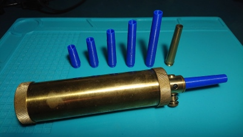
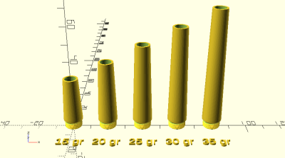
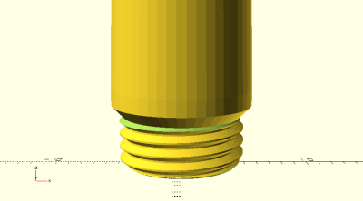

# Parametric Powder Flask Spout

<table>
<tr>
<td></td>
<td></td>
</tr>
<tr>
<td></td>
</tr>
</table>

A parametric black powder flask spout that fits Traditions (e.g. A1292, A1201) and similar black powder flasks. Sized to the volume ratio of 15 grains to 1 cubic centimeter. Threads should be printed at 0.10mm layer height for smooth fit. Use at your own risk. Made with OpenSCAD.

**Design:** [powder_flask_spout.scad](powder_flask_spout.scad)

**Example:** [example.scad](example.scad)

**STLs:**

* [powder_flask_spout_15gr.stl](stl/powder_flask_spout_15gr.stl)
* [powder_flask_spout_20gr.stl](stl/powder_flask_spout_20gr.stl)
* [powder_flask_spout_25gr.stl](stl/powder_flask_spout_25gr.stl)
* [powder_flask_spout_30gr.stl](stl/powder_flask_spout_30gr.stl)
* [powder_flask_spout_35gr.stl](stl/powder_flask_spout_35gr.stl)

**Recommended Print Settings:** 0.10mm layer height for threads, default infill, no supports

**Thingiverse:** https://www.thingiverse.com/thing:4541671

**License**: 
